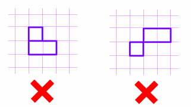

# 🚢 Battleship field validator

Nivel de dificultad: 3kyu <br>
Creado por: [romanzes](https://www.codewars.com/users/romanzes) 🚀

## 📖 Descripción

Escribe un método que reciba como argumento un campo del conocido juego de mesa "Batalla Naval" y devuelva `true` si la disposición de los barcos es válida, o `false` en caso contrario. El argumento será siempre un array bidimensional de 10x10. Los elementos del array son números: 0 si la celda está libre y 1 si está ocupada por un barco.

La Batalla Naval (también conocida como Battleships o Sea Battle) es un juego de adivinanza para dos jugadores. Cada jugador tiene una cuadrícula de 10x10 que contiene varios "barcos" y el objetivo es destruir las fuerzas enemigas apuntando a celdas individuales en su campo. Un barco ocupa una o más celdas en la cuadrícula. El tamaño y el número de barcos pueden variar según la versión. En este kata usaremos la versión soviética/rusa del juego.


Antes de que comience el juego, los jugadores preparan el tablero y colocan los barcos de acuerdo con las siguientes reglas:
Debe haber un solo acorazado (de tamaño 4 celdas), 2 cruceros (de tamaño 3), 3 destructores (de tamaño 2) y 4 submarinos (de tamaño 1). No se permiten barcos adicionales ni tampoco que falte alguno.
Cada barco debe estar en línea recta, excepto los submarinos, que ocupan solo una celda.


Los barcos no pueden superponerse ni estar en contacto con ningún otro barco, ni por los lados ni por las esquinas.



Esto es todo lo que necesitas para resolver este kata. Si te interesa más información sobre el juego, visita este enlace.


## 📝 Resultados

### ✍️ Mi solución

```js
function validateBattlefield(field) {

    // Creamos un array para saber cuantos barcos encontramos.
    let boatsFind = Array(10).fill(null).map(() => Array(10).fill(false));
    let validBoats = []

    // Para encontrar barcos (solo 4 direcciones).
    const directionsExplore = [
        [-1, 0], [1, 0], [0, -1], [0, 1]
    ];

    // Para validar que no se toquen (8 direcciones).
    const directionsValidate = [
        [-1, 0], [-1, 1], [0, 1], [1, 1],
        [1, 0], [1, -1], [0, -1], [-1, -1]
    ];

    /**
     * Valida las coordenadas para solo devolver numeros diferentes a undefined.
     * @param {number} i Coordenada y (izquierda a derecha).
     * @param {number} j Coordenada x (arriba a abajo).
     * @returns true si las coordenadas son validas, del contrario false.
     */
    function validateCoords(i,j) {
        return j >= 0 && j < 10 && i >= 0 && i < 10
    }

    /**
     * Encontrar todos los barcos validos o invalidos y retornar un array con el barco completo.
     * @param {number} i Coordenada y (izquierda a derecha).
     * @param {number} j Coordenada x (arriba a abajo).
     */
    function validateBoatsFind(i,j) {
        let boat = []

        boatsFind[i][j] = true;
        boat.push([i,j])

        for (let d=0;d<directionsExplore.length;d++) {
            const newRow = i + directionsExplore[d][0]
            const newCol = j + directionsExplore[d][1]

            if (validateCoords(newRow,newCol) && field[newRow][newCol] === 1 && !boatsFind[newRow][newCol]) {
                let boatFull = validateBoatsFind(newRow,newCol)
                boat.push(...boatFull)
            }
        }
        return boat;
    }

    /**
     * Valida la cantidad de barcos disponibles.
     * @param {*} validBoats 
     * @returns true si todo esta bien, del contrario false.
     */
    function validateBoatCounts(validBoats) {
        let counts = {1: 0, 2: 0, 3: 0, 4: 0};
        
        // Contar cada barco según su tamaño
        for (let boat of validBoats) {
            let size = boat.length;
            
            if (size >= 1 && size <= 4) {
                counts[size]++;
            } else {
                return false;  
            }
        }
        
        return counts[4] === 1 && 
            counts[3] === 2 &&  
            counts[2] === 3 &&  
            counts[1] === 4;   
    }

    /**
     * Retorna si una parte del barco pertenece al mismo o no.
     * @param {*} row fila del barco siguiente.
     * @param {*} col columna del barco siguiente.
     * @param {*} boat barco actual a comparar
     * @returns si hay alguna diferencia retorna false, por el contrario true
     */
    function isOwnBoat(row, col, boat) {
        for (let i = 0; i < boat.length; i++) {
            if (boat[i][0] === row && boat[i][1] === col) {
                return true;
            }
        }
        return false;
    }

    /**
     * Validamos si hay alguna falla en los barcos, si es asi retorna false y si no true.
     * @param {Array} boat el array de barcos
     * @returns true o false
     */
    function validateNoTouch(boat) {
        for (let i = 0; i < boat.length; i++) {
            let [row, col] = boat[i];
            
            for (let d = 0; d < directionsValidate.length; d++) {
                const newRow = row + directionsValidate[d][0];
                const newCol = col + directionsValidate[d][1];
                
                if (validateCoords(newRow, newCol) && 
                    field[newRow][newCol] === 1 &&
                    !isOwnBoat(newRow, newCol, boat)) {
                    return false;  // ¡Se tocan con otro barco!
                }
            }
        }
        return true;  // ✅ No se tocan
    }

    /**
     * Validar si la anchura de los barcos esta correcta.
     * @param {Array} boat Barco a validar.
     * @returns true si todo esta bien, del contrario false.
     */
    function validateStraightLine(boat = []) {
        if (boat.length === 1) return true;  // Submarino siempre valido
        
        // Extraer la primera celda
        let firstRow = boat[0][0];
        let firstCol = boat[0][1];
        
        // ¿Todas las celdas tienen la misma fila?
        let allSameRow = true;
        for (let i = 1; i < boat.length; i++) {
            if (boat[i][0] !== firstRow) {
                allSameRow = false;
                break;
            }
        }

        // ¿Todas las columnas son iguales? → Vertical
        let allSameCol = true;
        for (let i = 1; i < boat.length; i++) {
            if (boat[i][1] !== firstCol) {
                allSameCol = false;
                break;
            }
        }

        return allSameRow || allSameCol;
    }

    // Recorremos las filas y las columnas en un ciclo for anidado.
    for (let i=0;i<10;i++) {
        for (let j=0;j<10;j++) {
            if (field[i][j] === 1 && !boatsFind[i][j]) {
                validBoats.push(validateBoatsFind(i,j))
            }
        }
    }

    for (let boat of validBoats) {
        console.log(boat)
        if (!validateStraightLine(boat)) return false
        if (!validateNoTouch(boat)) return false
    }

    if (!validateBoatCounts(validBoats)) return false;

    return true
}
```

### 🌟 Solución mejor calificada (+436 iguales)

```js
function validateBattlefield(field) {
  var hit = (row, col) => (row < 0 || col < 0 || row > 9 || col > 9) ? 0 : field[row][col];
  for (var ships = [10,0,0,0,0], row = 0; row < 10; row++) {
    for (var col = 0; col < 10; col++) {
      if ( hit(row,col) ) {
        if ( hit(row-1, col-1) || hit(row-1, col+1) ) return false; // Corner is touching
        if ( hit(row-1, col  ) && hit(row  , col-1) ) return false; // Side is touching
        if ( ( field[row][col] += hit(row-1, col) + hit(row, col-1) ) > 4 ) return false; // Ship is too long
        ships[field[row][col]]++; ships[field[row][col] - 1]--;
  } } }
  return [0,4,3,2,1].every((s,i) => s == ships[i]);
}
```

## 💡 Experiencia

Bueno... Por donde empezar 🤔🥲 con este ejercicio aprendo sobre un nuevo tipo de algoritmo llamado **DFS (Depth-First Search)** junto a otros temas mas conocidos para mi persona como la **Recursividad** que se aplica en la parte principal de este ejercicio, fue un ejercicio en el que me apoye mucho con IA principalmente para el ejercicio que encontraran en `false` que me sugirio Claude Sonnet 4.5 a realizar para entender mejor como funcionaba el algoritmo mencionado anteriormente (DFS) el cual entendi bien aunque debo practicarlo para que no se me olvide. Fueron largas horas de practica hoy asi que... Ese fue el ejercicio de hoy, no parare y a todo el que lea este README le sugiero que no lo haga tampoco jeje. Saludos! (Me pregunto como la gente llega a esas conclusiones tan rapidas como la del primer lugar 🥲🤔).
