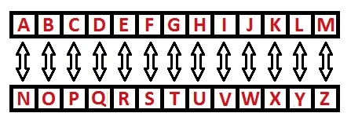

# 📄 Rot 13

Nivel de dificultad: 5kyu <br>
Creado por: [Rubikan](https://www.codewars.com/users/Rubikan) 🚀

## 📖 Descripción

ROT13 es un cifrado de sustitución de letras simple que reemplaza una letra por la que se encuentra 13 posiciones después en el alfabeto. ROT13 es un ejemplo del cifrado César.

Crea una función que reciba una cadena y devuelva la cadena cifrada con Rot13.
Si en la cadena hay números o caracteres especiales, estos deben devolverse tal cual.
Solo las letras del alfabeto latino/inglés deben desplazarse, como en la implementación original de Rot13.

## 📝 Resultados

### ✍️ Mi solución

```js
const cipher = {
  a: "n", b: "o", c: "p", d: "q", e: "r", f: "s", g: "t", h: "u", i: "v", j: "w", k: "x", l: "y", m: "z",
  n: "a", o: "b", p: "c", q: "d", r: "e", s: "f", t: "g", u: "h", v: "i", w: "j", x: "k", y: "l",
  z: "m"
};

function rot13(message){
    if (!message) return message

    return message.split("").map((letter) => {
        if (!letter.match(/[a-z]/i)) return letter
        let isUppercase = letter === letter.toUpperCase()
        return isUppercase ? cipher[letter.toLowerCase()].toUpperCase() : cipher[letter.toLowerCase()]
    }).join("")
}
```

### 🌟 Solución mejor calificada (+48 votos)

```js
function rot13(message) {
  var a = "abcdefghijklmnopqrstuvwxyzABCDEFGHIJKLMNOPQRSTUVWXYZ"
  var b = "nopqrstuvwxyzabcdefghijklmNOPQRSTUVWXYZABCDEFGHIJKLM"
  return message.replace(/[a-z]/gi, c => b[a.indexOf(c)])
}
```

## 💡 Experiencia

Primordialmente, quede completamente anodadado porque no sabia que era el rot13 asi que me puse en la investigacion JAJA y descubri que funciona de la manera en como se muestra en la imagen a continuacion.



Ya una vez teniendo eso claro procedi creando el diccionario con las respectivas letras como se ve en el codigo y un algoritmo que en base a la letra (si estaba en mayuscula o minuscula) lo transformara y... Funciono! Pero, sucede que las ultimas dos pruebas no dian prueba exitosa por lo que me puse en la mision de buscar que podia ser hasta que por azares del destino el copilot (debo desactivarlo para este tipo de cosas jeje) me coloco la expresion regular de solo letras y ahi fue donde entre en cuenta que **rot13 solo permite caracteres sin simbolos** y finalmente aplicado eso todo salio exitoso.
